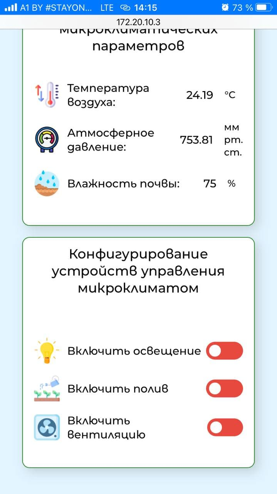

## Описание работы с файлами веб-интерфейса

**1. Файлы в ветке:**
    - Файл *index.html* содержит гипертекстовую разметку страницы. 
    - Файл *style.css* содержит стилистическое оформление веб-интерфейса

**2. Комментарии по коду:**
    - Помимо гипертекстовой разметки в файле *index.html* содержатся AJAX-запросы. В разметку встроен тег `<script>` содержащий функциии `setInterval(lambda, interval)` опрашивающие веб-сервер каждые 5000 мс с момент последней загрузки веб-страницы.
    - Также в теге `<script>` содержится обработчики событий измененения состояния тега `<input>`

**3. Медиа-содержимое:**
Внешний вид веб-интерфейса на персональном компьюетере разрешением 1366x768:

Внешний вид веб-интерфейса на смартфоне iPhone 6s:

